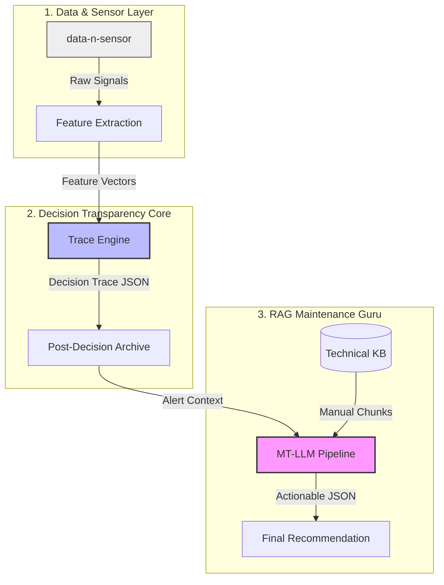

# 🏭 IOT-Trace: Explainable Predictive Maintenance System

## 📌 Overview
**IOT-Trace** is an end-to-end industrial monitoring solution that prioritizes **Decision Transparency**. Unlike traditional "black-box" AI models, IOT-Trace records the exact reasoning path of every alert, integrates it with technical knowledge bases, and provides actionable maintenance recommendations.

The system is designed to build trust between AI and industrial engineers by making every automated decision inspectable, replayable, and auditable.

---

## 🏗️ System Architecture & Pipeline

The project follows a linear pipeline from raw sensor simulation to final maintenance instructions.



---

## 📂 Project Components

### 1. `data-n-sensor`
The simulation layer that generates synthetic industrial sensor data.
- **`data_generated.py`**: Simulates assets like Pumps, Conveyors, and Compressors.
- **`feature_extraction.py`**: Processes raw signals into RMS, trends, and deltas for the decision engine.

### 2. `trace-engine`
The deterministic heart of the system.
- **Rules-Based Inference**: Applies human-defined thresholds to feature vectors.
- **Trace Generation**: Produces a `reasoning_trace` showing exactly which rules fired and how confidence accumulated.
- **Visual UI**: A Streamlit interface to inspect live traces and system health.

### 3. `mt-llm`
The interpretation layer that adds human context to technical traces.
- **Knowledge Retrieval**: Uses a RAG pattern to fetch relevant maintenance manual snippets based on the alert type.
- **LLM Orchestration**: Converts the technical trace and retrieved manuals into safe, actionable maintenance advice.

---

## 🚀 Getting Started

### Prerequisites
- Python 3.8+
- [Requestly Desktop App](https://requestly.io/) (used for mocking the Knowledge Base API)

### Installation
1. Clone the repository.
2. Create and activate a virtual environment.
3. Install dependencies:
   ```bash
   pip install -r requirements.txt
   ```

### Execution Flow
1. **Generate Data**: Run the sensor simulation in `data-n-sensor/`.
2. **Launch Trace Engine**: Run the Streamlit UI in `trace-engine/ui/app.py`.
3. **Run Maintenance Pipeline**: Execute `mt-llm/run_full_pipeline.py` to generate the final advice based on thelatest traces.

---

## 🧠 Core Philosophy: "Trace First"
Explainability should be **intrinsic**, not post-hoc.
- **Traditional AI**: Guess -> Post-decision explanation (often hallucinated).
- **IOT-Trace**: Record path -> Logical retrieval -> Verified advice.

**If the system cannot show how it reasoned, it should not be trusted.**

